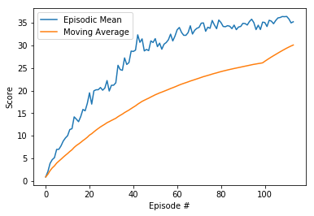

# Report

**Author:** _Ioannis Souflas_

### Introduction

The objective of this project is to train a Deep Deterministic Policy Gradient (DDPG) agent to control robotic arms using Unity's [Reacher](https://github.com/Unity-Technologies/ml-agents/blob/master/docs/Learning-Environment-Examples.md#reacher) enviroment to maintain in contact with the green spheres.

A [README](https://github.com/ioasou/deep-reinforcement-learning/blob/master/p2_continuous-control/README.md) file can be found in the root of the repository.

Detailed description of the enviroment solution can be found in the [Solution.ipynb](https://github.com/ioasou/deep-reinforcement-learning/tree/master/p1_navigation/Navigation_Solution/Solution.ipynb) Juputer script. 

The solution is based on the [DDPG exersice](https://github.com/ioasou/deep-reinforcement-learning/blob/master/ddpg-pendulum/DDPG.ipynb).

**External References:** [DDPG Algorithm - DeepMind](https://arxiv.org/pdf/1509.02971.pdf), [Learning to Drive Smoothly in Minutes](https://towardsdatascience.com/learning-to-drive-smoothly-in-minutes-450a7cdb35f4), [Learning to Drive in a Day](https://arxiv.org/pdf/1807.00412.pdf)


### Learning Algorithm: Deep Deterministic Policy Gradient (DDPG)

DDPG is model-free reinforcement learning algorithm which consists of two main components: an actor which directly estimates the policy required to achieve the desired goal and a critic which assess the policy provided by the actor. In other words DDPG combines policy-based (actor) and value-based (critic) methods to improve the overall pefromance of the agent. The policy is updated after each episode. One important aspect of the algorithm is that it has a memory, called replay buffer, where its interactions with its environment are recorded and can be “replayed” afterward. By sampling from it randomly, the transitions that build up a batch are decorrelated. It has been shown that this greatly stabilizes and improves the training procedure. DDPG is an off-policy learning algorithm, meaning that actions performed during training come from a policy distinct from the learnt optimal policy by the actor. This happens in order to gain diverse state-action data outside of the narrow distribution that would be seen by the optimal policy, and thus increase robustness. We use a standard method of achieving this in the context of continuous reinforcement learning methods: our exploration policy is formed by adding discrete Ornstein-Uhlenbeck process noise to the optimal policy.

The actor network takes as inputs the states of the enviroment and returns the policy that is supposed to achieve the desired goal. The actor network consists of 3 fully connected layer. 

The critic network takes as inputs the states of the enviroment and the output of the actor network with the purpose of evaluating  whether the actor policy is optimal. The critic network consits of 3 fully connected layers. 

The hyper parameters of the main DDPG algorithm are listed below (the values can be found in [Solution.ipynb](https://github.com/ioasou/deep-reinforcement-learning/blob/master/p2_continuous-control/ContinuousControl_Solution/Solution.ipynb)):

- n_episodes: maximum number of training episodes
- max_t: maximun number of timesteps per episode (episode duration)
- desired_reward: the enviroment is considered to be solved when the average reward (over 100 episodes) is greater than the desired_reward
- moving_average_lentgh: size of the moving average window used to evaluate the performance of the DDPG
- print_every: frequency at which the results are printed
- train_mode: when true the agent will start training

The hyper parameters of the agent are listed below (the values can be found in [ddpg_agent.py](https://github.com/ioasou/deep-reinforcement-learning/blob/master/p2_continuous-control/ContinuousControl_Solution/ddpg_agent.py)):

- BATCH_SIZE: mini batch size
- GAMMA: discount factor
- TAU: for soft update of target parameters
- LR_ACTOR: learning rate for actor
- LR_CRITIC: learning rate for critic
- BUFFER_SIZE: replay buffer size
- WEIGHT_DECAY: L2 weight decay
- LEARN_EVERY: learning timestep interval
- LEARN_NUM: number of learning passes

The agent was trained on a Ubuntu machine (64bit) with the use of GPU.


### Plot of Rewards



**Training Results (Last 3 Episodes)**
```
Episode 112	Mean over an Episode: 35.9	Moving Average: 29.6
Episode 113	Mean over an Episode: 35.0	Moving Average: 29.9
Episode 114	Mean over an Episode: 35.2	Moving Average: 30.1
Agent trained successfully!	Moving Average =30.1 over the last 100 episodes
```

### Ideas for Future Work

1. Investigate different ramdomisation approaches for selecting random actions.
2. Investigate performance of Prioritised Experience Replay.
3. Investigate perfomance of different algorithms such as [D4PG](https://arxiv.org/abs/1804.08617.pdf) and [TRPO](https://arxiv.org/abs/1502.05477.pdf).
4. Investigate the effect of hyper parameters and automate selection approach.
